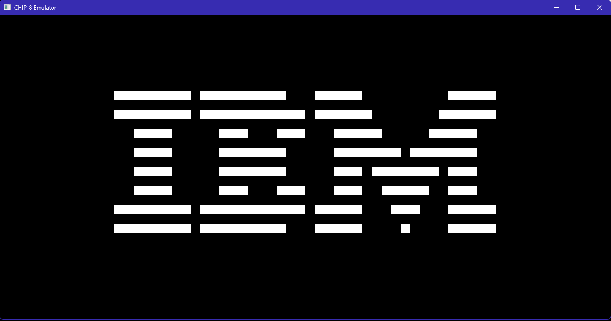

<p align="center">
  
  
</p>

# chip8-aelys

A CHIP-8 CPU interpreter/emulator written entirely in [Aelys](https://github.com/vbxq/aelys_lang), my own programming language.

## Why?

CHIP-8 is simple enough to implement in a weekend, but complex enough to stress-test a language's fundamentals: bitwise ops, arrays, control flow, FFI, etc

This whole thing is under 500 lines of Aelys. It serves as both a proof that the language can handle real projects and as dogfooding

Building an emulator is a nice way to see what's your language lacking (at the time of this writing, proper switch case/good structs, etc.)

Also, it's quite fun to do !

## Quick start

```bash
aelys-cli run main.aelys --allow-caps=fs,exec,window,gpu
```

This loads `rom.ch8` from the script directory by default. If you want to specify a ROM:

```bash
aelys-cli run main.aelys --allow-caps=fs,exec,window,gpu -- path/to/rom.ch8
```

## Keypad

CHIP-8 uses a 16-key hex keypad. Mapped to:

```
CHIP-8       Keyboard
1 2 3 C      1 2 3 4
4 5 6 D      Q W E R
7 8 9 E      A S D F
A 0 B F      Z X C V
```

## Requirements

- [Aelys](https://github.com/vbxq/aelys_lang) >= 0.19.7
- The `opengl` native module from [there](https://github.com/vbxq/aelys_lang/tree/master/examples/native/opengl) (bundled as `opengl.dll` / `opengl.so`), but I already included it in the repo !